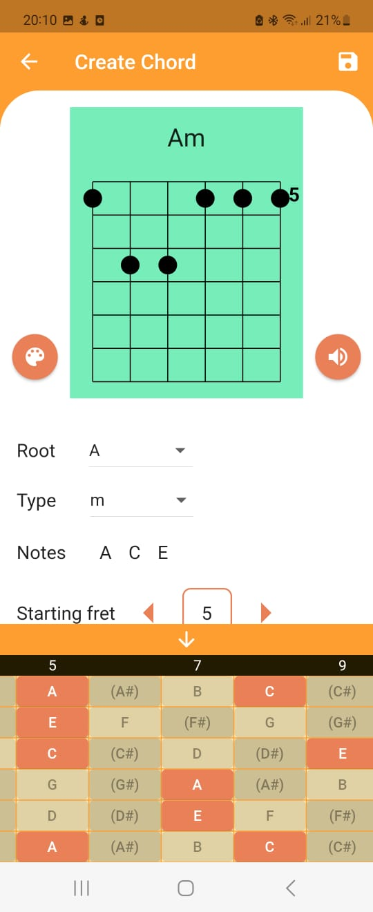
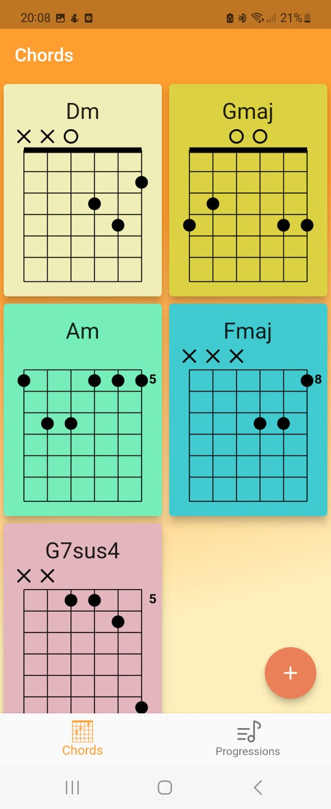
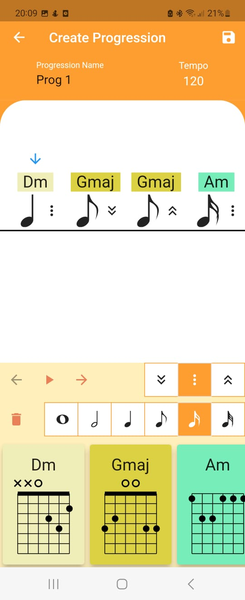

# Chords Log

This application is made using Flutter for experimenting with and learning the guitar chords on a given scale.

## Screenshots

<table>
  <tr>
    <td></td>
    <td></td>
    <td></td>
  </tr>
</table>

Created by Aryan Akr
